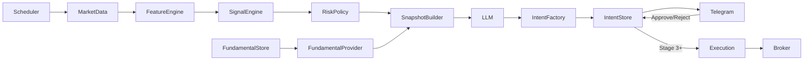

## Architecture (blueprint)

Этот документ фиксирует **целевую архитектуру** и **план внедрения** для проекта `lazy-investor` на основе `SPEC.md` и текущего состояния кода.
Цель документа — чтобы следующий этап разработки был максимально механическим: берём пункты из roadmap и выполняем шаг за шагом.

---

### 1) Контекст и цели

- **Safety-first**: система предлагает решения, но не “торгует сама” без строгих лимитов и аудита.
- **Детерминированное ядро**: данные → фичи → сигналы → риск/политики — только кодом, воспроизводимо.
- **LLM как советник**: LLM работает только со структурированным snapshot и отдаёт структурированный intent. LLM не имеет прямого доступа к исполнению.
- **Human-in-the-loop**: подтверждение `Approve/Reject` в Telegram обязательно для MVP.
- **Knowledge in context**: LLM дополнительно получает “локальные знания” из репозитория (Markdown), выбранные явным списком.

---

### 2) Текущее состояние (as-is)

Что уже реализовано в репозитории:

- **Entrypoint**: `cmd/analyst/main.go` — запуск + graceful shutdown.
- **DI**: Google Wire (`pkg/wire`).
- **Config**: YAML (`pkg/config`, файл `config.yml`).
- **Logging**: zerolog-обёртка (`pkg/logging`).
- **Ports**: есть контракт `ports.MarketDataProvider`.
- **Adapters**:
  - `internal/adapters/marketdata/tinkoff` — реализация `MarketDataProvider` через Tinkoff Invest API (свечи, поиск инструмента, Stop()).
  - `internal/adapters/report/chart` — сервис отрисовки PNG-графиков (полезно для отчётов в Telegram).
- **Application**: `internal/application` пока только держит зависимости и ждёт `ctx.Done()` (пайплайна ещё нет).

Важно: текущая структура уже близка к “ports/adapters”, поэтому мы развиваем её без резких переработок.

---

### 3) Целевая архитектура (to-be)

Мы строим систему в стиле **Hexagonal (Ports & Adapters)**:

- **Core (детерминированное ядро)**:
  - расчёты фич/индикаторов;
  - стратегии/сигналы;
  - риск-контроль и политики;
  - сборка snapshot;
  - валидация/формирование intents.
- **Application (оркестрация use-cases)**:
  - планирование (scheduler);
  - пайплайн “Advisor” и “Backtest”;
  - координация портов (market data, storage, telegram, llm, broker/sim).
- **Adapters (инфраструктура/интеграции)**:
  - Tinkoff API, Telegram Bot API, LLM provider, хранилище, индикаторные библиотеки, симулятор бэктеста.

**Ключевое правило**: домен/ядро не импортирует внешние SDK и библиотеки напрямую.
Импорты внешних библиотек допустимы **только** внутри `internal/adapters/*` (или внутри явно выделенного `infra/`, если это чистая инфраструктура).

---

### 4) Модули и ответственность

Ниже — “что должно существовать” в MVP (соответствует `SPEC.md`).

- **Scheduler**
  - запускает цикл по таймфрейму;
  - защищает от параллельных запусков одного окна времени.

- **MarketData**
  - выдаёт свечи + метаданные инструмента (через порт `MarketDataProvider`).

- **FeatureEngine** (детерминированно)
  - считает фичи/индикаторы (доходности, волатильность, тренды, уровни и т.п.).

- **SignalEngine** (детерминированно)
  - запускает стратегии и формирует сигналы.

- **Policy & Risk Engine** (детерминированно)
  - применяет жёсткие лимиты и “no-trade” правила;
  - считает разрешённый размер позиции;
  - гарантирует, что intent не выйдет за лимиты даже если LLM “попросит”.

- **Knowledge Base (LLM Context)** (детерминированно)
  - источник “знаний” для LLM из локальных Markdown-файлов.
  - выбор файлов делается явным manifest-ом (список путей).
  - сборка “knowledge pack” должна быть воспроизводимой:
    - фиксированный порядок файлов,
    - явные разделители,
    - лимит по объёму (чтобы не взорвать контекст).
  - это **не** fine-tuning и **не** замена политик/риска. Это справочный слой для LLM.

- **Fundamental Analysis (optional, offline ingestion)**
  - отдельный контур, который **не** выполняется внутри Advisor цикла.
  - запускается отдельной командой/процессом: ходит по whitelist источникам (RSS/страницы), забирает контент, извлекает текст.
  - прогоняет извлечённое через **LLM Fundamental Analyst** (может быть другой провайдер/другая модель, чем LLMAdvisor).
  - сохраняет результаты в `Fundamental Store` (БД/файлы — позднее решим), чтобы Advisor мог добавлять их в snapshot как контекст.

- **LLM Advisor**
  - вход: компактный snapshot (JSON);
  - выход: intent (JSON);
  - никаких побочных эффектов (никаких “place order”).

- **LLM Provider Abstraction (architecture rule)**
  - app/core не должны зависеть от конкретного LLM API/SDK.
  - вместо “универсального чат-клиента” используем узкие порты по use-case:
    - `LLMAdvisor` для intents,
    - `LLMFundamentalAnalyst` для фундаментального ingestion,
    - при необходимости — отдельные порты под новые сценарии.
  - выбор провайдера делается конфигурацией **по use-case** (advisor vs fundamental).
  - реализация провайдеров живёт в `internal/adapters/llm/*`; допускается единый `factory/router` внутри адаптера.
  - на границе адаптера обязательно:
    - лимитирование размера контекста,
    - таймауты + retry/backoff (аккуратно),
    - строгая JSON-валидация ответа (schema),
    - audit-логирование (provider/model/prompt version + hashes).

- **Intent Store**
  - хранит intents и решения пользователя;
  - обеспечивает TTL, идемпотентность, аудит.

- **Telegram Bot**
  - отправляет отчёт + intent;
  - принимает `Approve/Reject`;
  - проверяет TTL + “однократность” решения.

- **Execution Engine** (после MVP, Stage 2+)
  - формирует ордер детерминированно;
  - валидирует ограничения (лотность, шаг цены, торговые часы);
  - отправляет ордер в брокера (или в sandbox).

---

### 5) Порты (контракты)

Принцип: **Application/Core зависят от интерфейсов**, адаптеры реализуют эти интерфейсы.

Уже есть:

- `ports.MarketDataProvider`

Планируем добавить (минимально для Stage 1):

- `ports.Scheduler` (или просто сервис в app-слое, если пока проще)
- `ports.IndicatorProvider`
- `ports.StrategyProvider`
- `ports.LLMAdvisor`
- `ports.KnowledgeProvider` (выдаёт “knowledge pack” для LLM по manifest-у)
- `ports.FundamentalProvider` (читает фундаментальные результаты из store для добавления в snapshot)
- `ports.TelegramNotifier`
- `ports.IntentStore`

Планируем для Stage 2+:

- `ports.BrokerAdapter` (реальный брокер)
- `ports.BacktestAdapter` (симулятор на истории)

Порты для offline ingestion (Stage 4, опционально):

- `ports.FundamentalFetcher` (скачивает HTML/RSS/текст по whitelist)
- `ports.FundamentalExtractor` (извлекает “чистый текст” + метаданные)
- `ports.LLMFundamentalAnalyst` (LLM для фундаментального анализа; может отличаться от `LLMAdvisor`)
- `ports.FundamentalStore` (сохранение результатов фундаментального анализа)

Примечание по LLM:

- Для каждого use-case допускается отдельный провайдер/модель и отдельные лимиты/таймауты.
- В коде приложения не должно быть `switch provider` в нескольких местах. Выбор провайдера концентрируем в одном месте (factory/router).

Примечание по индикаторам: по требованиям `SPEC.md` любые внешние библиотеки (`cinar/indicator`, `go-talib`) подключаются **только через адаптеры**.
Вне адаптеров в коде **не должно быть импортов** этих библиотек.

---

### 6) Данные и контракты

Сейчас используется слой `internal/dto` как контракт между брокерским API и приложением (свечи/инструменты).
Это хороший старт, но нам нужно явно отделить:

- **DTO (integration contract)**: то, что приходит “снаружи” и передаётся через порты (`dto.Candle`, `dto.Instrument`).
- **Domain (business model)**: то, что является “истиной” для расчётов и решений (intent, signal, risk, portfolio).

Решение для ближайших этапов (чтобы не тормозить разработку):

- В Stage 0–1 допускаем использовать `internal/dto` как вход в ядро.
- Параллельно вводим `internal/domain` с ключевыми сущностями:
  - `Timeframe`, `Signal`, `Intent`, `IntentStatus`, `PolicyLimits`, `RiskDecision`, `Portfolio` (минимально).
- Любое “решение” (сигнал/интент) живёт в domain-типах, а не в dto.

**Snapshot (вход LLM)** и **Intent (выход LLM)** должны быть строго структурированы (JSON), компактны и удобны для аудита.
Схемы фиксируем рядом с кодом (например, в `internal/app/schemas/` или `internal/domain/schemas/`) и валидируем на границе адаптера LLM.

Дополнение: помимо snapshot, LLM получает **knowledge pack** (текст из `knowledge/*.md`).
На первом этапе knowledge pack — это просто “склейка” выбранных файлов (с заголовками/сепараторами).
Позже это можно эволюционировать в управляемую базу (но сейчас это вне scope).

---

### 7) Основные потоки (pipelines)

#### 7.1 Advisor (основной, безопасный)

1. Scheduler выбирает окно времени.
2. MarketData грузит свечи/метаданные.
3. FeatureEngine считает фичи/индикаторы.
4. SignalEngine считает сигналы стратегий.
5. Policy/Risk применяет лимиты и решает “можно ли вообще предлагать intent”.
6. SnapshotBuilder собирает snapshot.
7. (опционально) FundamentalProvider добавляет фундаментальный контекст из store (если включено).
8. KnowledgeProvider собирает knowledge pack (по manifest-у).
9. LLMAdvisor получает snapshot + knowledge pack (+ optional fundamental context) и возвращает intent (как рекомендацию).
10. IntentFactory (детерминированно) нормализует intent и сохраняет в IntentStore со статусом `pending` и TTL.
11. Telegram отправляет отчёт + кнопки `Approve/Reject`.
12. На `Approve`:
   - записываем audit decision,
   - (Stage 2+) формируем ордер детерминированно и исполняем через BrokerAdapter.

#### 7.3 Fundamental ingestion (опционально, отдельная команда)

Это отдельный процесс, который готовит данные для Advisor:

1. FundamentalFetcher скачивает контент по whitelist источникам.
2. FundamentalExtractor приводит контент к “чистому тексту” + метаданным.
3. LLMFundamentalAnalyst анализирует текст и возвращает структурированный результат.
4. FundamentalStore сохраняет записи (источник → текст/хеш → результат → привязка к инструменту/времени).

#### 7.2 Backtest / Paper (на истории)

То же самое, но:

- MarketData читает историю (файлы/кэш/провайдер).
- BrokerAdapter заменён на `BacktestAdapter`, который:
  - ведёт виртуальный портфель,
  - применяет комиссии/проскальзывание (простая модель на старте),
  - пишет журнал сделок + метрики.

---

### 8) Инварианты безопасности (обязательные правила системы)

Эти правила должны быть истинны всегда. Их проверяем тестами.

- **No direct execution from LLM**: LLM не может инициировать выставление ордеров.
- **Deterministic mapping**: intent → order строится только детерминированным кодом.
- **Risk gate before anything**: если риск/политики запрещают, intent не формируется/не отправляется.
- **TTL**: нельзя подтвердить intent после `expires_at`.
- **Idempotency**: один intent можно подтвердить/исполнить только один раз.
- **Auditability**: сохраняем хеш/ссылки на входные данные, рассчитанные фичи, сигналы, решение LLM, решение пользователя, итог.

---

### 9) Предлагаемая структура директорий (эволюционно)

Чтобы не ломать текущий код “в ноль”, двигаемся постепенно.

Стабильная целевая структура (из `SPEC.md`, адаптированная к текущей базе):

- `cmd/`
  - `advisor/` (или переименовать текущий `analyst/` позже)
  - `backtest/` (будущий CLI)
  - `fundamental/` (опционально: offline ingestion команда для фундаментального контура)
- `internal/`
  - `application/` (оставляем как app-layer на старте)
  - `domain/` (новое: сущности и правила)
  - `ports/` (интерфейсы)
  - `adapters/`
    - `marketdata/tinkoff/`
    - `report/chart/`
    - `telegram/`
    - `llm/`
    - `store/`
    - `knowledge/fsmarkdown/` (простой адаптер: читает `knowledge/` + manifest)
    - `indicators/indicator/` (адаптер к `cinar/indicator/v2`)
    - `indicators/talib/` (адаптер к `go-talib`, позже)
- `pkg/` (текущие: config/logging/wire; позже можно перенести в `internal/infra/`, если захочется)
- `knowledge/` (Markdown-база знаний для LLM)
  - `manifest.yml` (или другой простой формат списка файлов; выбираем один)

Главное правило структуры: **ядро и app-layer не зависят от конкретных интеграций**.

---

### 10) Roadmap выполнения (пошагово, привязано к стадиям SPEC)

Ниже — “скелет” задач, который мы будем выполнять следующим этапом.

#### Stage 0 — Scheduler + MarketData + простые расчёты + Telegram отчёты (без LLM)

- Добавить базовый пайплайн в `internal/application`:
  - загрузка свечей по инструментам из `config.yml`;
  - базовые метрики/агрегации (без “классических” индикаторов);
  - генерация простого отчёта (текст + опционально PNG через `chart.Service`).
- Добавить Telegram адаптер (порт `TelegramNotifier` + реализация).
- Отправлять отчёт по расписанию/ручному запуску (пока можно без настоящего cron).

#### Stage 1 — индикаторы (2–3 штуки) + улучшение отчётов (всё ещё без LLM)

- Добавить `IndicatorProvider` + самый простой адаптер (выбор библиотеки фиксируем отдельно).
- Реализовать 2–3 индикатора (пример: SMA/EMA + RSI, или EMA + ATR).
- Добавить индикаторы в отчёт (текст и/или overlay линии на chart).

#### Stage 2 (MVP) — intents + Telegram Approve/Reject + Knowledge Base, без исполнения

- Ввести доменную модель `Intent` + `IntentStatus`.
- Ввести порт `IntentStore` (на старте: in-memory, с TTL).
- Ввести порт `LLMAdvisor` (на старте: stub/noop, возвращает HOLD или простое правило).
- Добавить **Knowledge Base**:
  - папка `knowledge/` с Markdown-файлами;
  - простой `knowledge/manifest.yml` со списком файлов для включения в контекст;
  - порт `KnowledgeProvider` + адаптер “чтение с диска”;
  - deterministic сборка knowledge pack (порядок/сепараторы/лимит по размеру).
- Реализовать полный цикл:
  - snapshot → llm → intent → store(pending) → telegram → approve/reject → store(decision).
- Добавить проверки:
  - TTL, idempotency, “решение только один раз”.

#### Stage 3 — исполнение после Approve (малые лимиты)

- Ввести порт `BrokerAdapter` и адаптер для Tinkoff (или sandbox, если доступен).
- Реализовать детерминированный `OrderBuilder`:
  - маппинг из intent в ордер,
  - валидации (лоты, шаг цены, торговые часы),
  - idempotency key.
- Исполнять только при строгих лимитах (конфиг).

#### Stage 4 (опционально) — фундаментальный ingestion + контекст в snapshot

- Добавить отдельную команду `cmd/fundamental`:
  - fetch (whitelist источники) → extract → llm fundamental analyst → store.
- Ввести `FundamentalProvider` в Advisor, чтобы добавлять результаты в snapshot.
- Сразу предусмотреть, что `LLMFundamentalAnalyst` может быть **другим провайдером/моделью**, чем `LLMAdvisor`.

#### Stage 5 — постепенная автоматизация

- Добавлять отдельные автоматические действия (например, защитные выходы),
  но только после укрепления Policy/Risk и аудита.

---

### 11) Тестовая стратегия (минимально необходимая)

- **Контрактные тесты портов**: одинаковый вход → одинаковый выход (детерминизм).
- **Risk/Policy тесты**: intent не проходит лимиты → отклоняется.
- **Idempotency/TTL тесты**: approve после TTL не проходит; повторный approve не проходит.
- **KnowledgeProvider тесты**: одинаковый manifest + одинаковые файлы → одинаковый knowledge pack (детерминизм, порядок, лимит).

Требование по `SPEC.md` для тестов сторонней библиотеки индикаторов:

- “indicator-specific” тесты делаем **опциональными** через Go build tags:
  - запускаются только так: `go test -tags=indicator ./...`
  - по умолчанию не запускаются и не ломают сборку при удалении зависимости.

---

### 12) Приложение: диаграмма потоков (для общего понимания)

